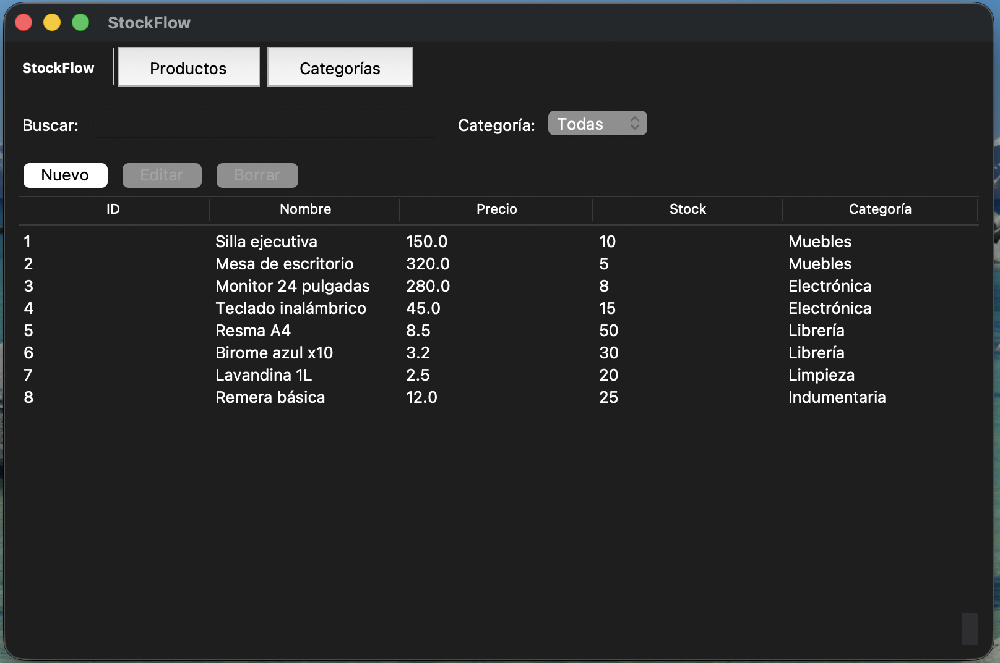

# StockFlow

Sistema de gestión de inventario de escritorio desarrollado en Python, con interfaz gráfica construida en Tkinter y base de datos SQLite local.

---

## Tabla de contenidos

- [Capturas](#capturas)
- [Funcionalidades](#funcionalidades)
- [Stack tecnológico](#stack-tecnológico)
- [Arquitectura](#arquitectura)
- [Instalación y uso](#instalación-y-uso)
- [Decisiones de diseño](#decisiones-de-diseño)
- [Próximos pasos](#próximos-pasos)
- [Autor](#autor)

---

## Capturas



> GIF de demostración


---

## Funcionalidades

- Gestión completa de productos (crear, editar, borrar, listar)
- Gestión completa de categorías
- Búsqueda de productos en tiempo real por nombre y categoría
- Filtro de productos por categoría mediante dropdown
- Borrado múltiple de registros con confirmación
- Validación de campos en formularios con mensajes de error inline
- Datos iniciales precargados al crear la base de datos
- Navegación entre secciones sin recargar la ventana principal

---

## Stack tecnológico

- **Python 3.13**
- **Tkinter** — interfaz gráfica de escritorio
- **SQLite3** — base de datos local embebida
- **Patrón Repository** — abstracción de acceso a datos
- **Arquitectura por capas** — presentación, servicios, repositorios, modelos

---

## Arquitectura

```
trabajo-final-integrador/
│
├── main.py                        ← entry point
├── config.py                      ← configuración global (DB_PATH, menús)
│
├── db/
│   ├── db_conexion.py             ← context manager de conexión SQLite
│   ├── esquema.py                 ← creación de tablas
│   └── datos_iniciales.py         ← seed de datos base
│
├── modelos/
│   ├── producto.py                ← dataclass Producto
│   └── categoria.py               ← dataclass Categoria
│
├── repositorios/
│   ├── repositorio_base.py        ← clase base abstracta con CRUD genérico
│   ├── repositorio_productos.py   ← queries específicas de productos
│   └── repositorio_categorias.py  ← queries específicas de categorías
│
├── servicios/
│   ├── servicio_base.py           ← lógica común entre servicios
│   ├── servicio_producto.py       ← reglas de negocio de productos
│   ├── servicio_categoria.py      ← reglas de negocio de categorías
│   └── validaciones/
│       ├── resultado_validacion.py  ← dataclass ResultadoValidacion
│       ├── validadores_texto.py     ← validar_texto
│       └── validadores_numericos.py ← validar_precio
│
└── ui/
    ├── app.py                     ← ventana principal, navegación
    ├── barra_navegacion.py        ← navbar con botones de sección
    ├── componentes/
    │   └── tabla.py               ← Treeview reutilizable con toolbar
    ├── formularios/
    │   ├── formulario_producto.py ← formulario de producto con validación inline
    │   └── formulario_categoria.py← formulario de categoría
    └── vistas/
        ├── vista_productos.py     ← vista con tabla, búsqueda y filtros
        └── vista_categorias.py    ← vista con tabla de categorías
```

### Flujo de capas

```
ui/vistas          → presentan datos, capturan acciones del usuario
      ↓
ui/formularios     → validan entrada, construyen el dict de datos
      ↓
servicios/         → validan reglas de negocio, construyen modelos
      ↓
repositorios/      → ejecutan SQL, mapean filas a modelos
      ↓
db/                → conexión y schema SQLite
```

Cada capa solo habla con la inmediatamente inferior. La UI no toca repositorios. Los repositorios no tienen lógica de negocio.

---

## Instalación y uso

**Requisitos:** Python 3.10 o superior (se usa `match` y union types).

```bash
# Clonar el repositorio
git clone https://github.com/roldn/stockflow.git
cd stockflow-tfi-talentotech

# No requiere dependencias externas — solo stdlib de Python

# Ejecutar
python3 main.py
```

La base de datos se crea automáticamente en `db/inventario.db` al primer arranque, con categorías y productos de ejemplo precargados.

---

## Decisiones de diseño

**Patrón Repository** — `RepositorioBase` define la interfaz (`obtener_por_id`, `obtener_todos`, `borrar`) y cada subclase implementa `tabla` y `_from_row`. Cambiar de SQLite a otro motor requiere tocar solo los repositorios.

**Validadores desacoplados** — `validar_texto` y `validar_precio` devuelven `ResultadoValidacion` en lugar de lanzar excepciones. El formulario los usa para mostrar errores inline; el servicio los usa para garantizar consistencia antes de persistir.

**Formularios específicos por entidad** — en lugar de un formulario genérico configurable, cada entidad tiene su propio formulario. Más código, pero más simple de debuggear y de extender.

**Datos iniciales con guard** — `cargar_datos_iniciales()` verifica `COUNT(*) > 0` antes de insertar. Si la base ya tiene datos, no hace nada. Si se borra la base, la próxima ejecución la recrea con datos de ejemplo.

---

## Próximos pasos

- [ ] Punto de venta (órdenes de compra y venta)
- [ ] Soporte para múltiples sucursales
- [ ] Historial de movimientos de stock
- [ ] Exportación a CSV
- [ ] `VistaBase` como clase abstracta común para todas las vistas
- [ ] Tests unitarios para servicios y validadores

---

## Autor

Francisco Roldán — QA Engineer & Automation Specialist  
[github.com/roldn](https://github.com/roldn)
